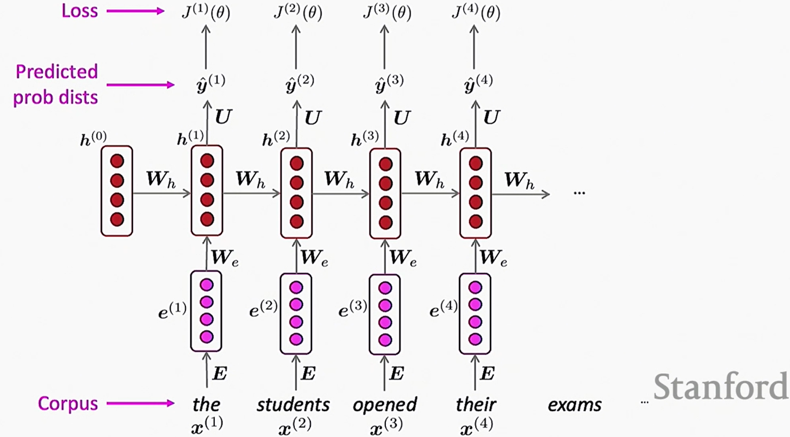

# LLMs/RNNs/LSTMs
## Introduction
- Regularization
- Dropout: drop inputs in hidden layers of the neural network (usually by adding a mask-layer). The model needs to learn knowing that sometimes some parameters/attributes might just not be present. Thus, it avoids feature co-adaptation, resulting in a good regularization.
- Vectorization: avoid using for loops. Using matrices is faster even running only on the CPU.
- Parameter initialization: you normally must initialize weights to small random values (i.e., NOT zero matrices!). To avoid symmetries that prevent learning/specialization.
- Optimizers: usually, plain SGD will work just fine. For more complex nets you can try more sophisticated "adaptative" optimizers that scale the adjustment to invididual parameters by an accumulated gradient (e.g. Adagrad, Adam, NAdamW)

## LLM
Language Modeling is the task of predicting what word comes next. In other words: a system that assigns probability to a piece of text.
Sparsity Problems:
- when a really specific combination of words never appeared in the corpus, then that probability is going to be 0 even if it could be realistic. Solution:
* add an small alpha to the count for every word in the vocabulary -> smoothing
* take less word from the condition to guess next words   -> backoff (maybe: "I took a bus during" was never on the data, but "I took a bus" could have been)

## RNN
Basically apply the same weights repeatedly, for every word.
Advantages:
- can process any length input
- computation for step t can use information from many steps back
- model size doesn't increase for longer input context (more computation tho)
- same weights applied on every timestep, so there is symmetry in how inputs are processed
Disadvantage:
- computation is slow! it's sequential, one vector at a time
- in practise, difficult to access information from many steps back
- forgets information back-in-time

